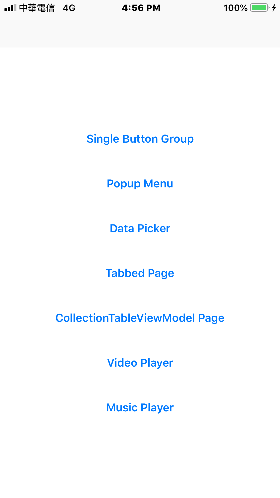

# TestFramework 

- TestFramework is just a demo project for my projects witch use Cocoapods.

## Features
- [Single Button Group](https://github.com/irons163/IRSingleButtonGroup)
- [Popup Menu](https://github.com/irons163/IRPopupMenu)
- [Data Picker](https://github.com/irons163/IRDataPicker)
- [Tabbed Page](https://github.com/irons163/IRTabbedPageViewController)
- [CollectionTableViewModel Page](https://github.com/irons163/IRCollectionTableViewModel)
- [Video Player](https://github.com/irons163/IRPlayer)
- [Music Player](https://github.com/irons163/IRMusicPlayer)

## Screenshots
| Main Page |
|:---:|
||
